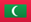

#  **Mission for Migrant Workers Maldives** 🌍

### 💬 **Who We Are**

**MMWM** is the first registered non-profit organization in the Maldives, standing strong for the rights of migrant workers. In a world where exploitation and systemic xenophobia have taken root, we're here to **transform** that reality. We're on a mission to ensure **equal rights**, **fair treatment**, and **human dignity** for all migrant workers in the Maldives.

We believe in **collective action** and **social responsibility**. Every step we take is grounded in justice and equality, and we’re here to make a real impact. Are you with us?

---

### 🔭 **Our Vision**

To **lead the charge** in the Maldives as the **go-to hub** for migrant workers' rights — advocating, protecting, and transforming their lives with a focus on **human rights** and **justice**. We believe in building a world where migrant workers are celebrated, not exploited.

---

### 🚀 **Our Mission**

Our mission is simple, but powerful. Here’s how we do it:

- 🌍 **Raise Awareness & Strengthen Legal Frameworks**  
  We believe in shaping policies and driving actions that align with **international standards** — because fair laws protect all workers, regardless of origin.

- 🛠️ **Safeguard Wellbeing**  
  Ensuring migrant workers have **access to basic needs** like healthcare, fair wages, and decent living conditions is essential. Their wellbeing is our priority.

- ⚖️ **Fight for Justice**  
  We strive to make sure that all migrant workers have access to **secure and fair legal recourse**, ensuring justice is always within reach.

- 📊 **Lead Research & Data Collation**  
  We’re committed to building data-driven, evidence-based policies that inform and create **lasting change**. Strong data leads to stronger laws.

- 🌐 **Operational Support & Capacity Building**  
  Our work is never solitary. We collaborate with governments, businesses, and NGOs to create **real impact**. Together, we can build better systems, both locally and internationally.

---

### 💡 **Our Core Values – The 5As**

**Approach**  
We lead with **human dignity** and a human rights-based approach — where everyone deserves the protection of their rights and freedoms.

**Acceptance**  
Diversity isn’t just something we respect; it’s something we celebrate! **Inclusion** is at the heart of everything we do.

**Alliance**  
We believe that collaboration is the key to success. We are committed to working with **all stakeholders** — local, regional, and international — to amplify our impact.

**Accountability**  
We hold ourselves to the highest standard. Transparency, responsibility, and integrity define how we operate. We take ownership and lead with honesty.

**Advance**  
Innovation is our compass. Whether it’s through **cutting-edge research** or **progressive development**, we always push forward for migrant workers’ rights.

---

### 🚨 **How You Can Get Involved**

The **power of change** starts with YOU! Here are ways you can make a meaningful impact with us:

- 🤝 **Collaborate**: Whether you're an individual, organization, or company, we welcome partnerships that amplify our mission.
- 💡 **Raise Awareness**: Spread the word! Let people know about the rights and struggles of migrant workers in the Maldives.
- 💪 **Support**: Every contribution, big or small, helps us fund projects that improve lives. Whether it's through donations or volunteering, you make a difference!

---

### 📢 **Connect With Us**

We’d love to hear from you! Follow, engage, or reach out to us on our social media platforms and help us spread the message of **justice** and **equality** for migrant workers.

- 🌐 **[Visit Our Website](https://www.mmwm.org.mv)**
- 📧 **[Email Us](mailto:info@mmwm.org.mv)**
- 📱 **Follow Us On Social Media:**
  - [Instagram](https://www.instagram.com/mmwmaldives)
  - [Facebook](https://www.facebook.com/mmwmaldives)
  - [X (formerly Twitter)](https://x.com/mmwmaldives)
  - [LinkedIn](https://www.linkedin.com/company/mmwmaldives)

---

### ✊ **Together, We Create Change**

No one should be subjected to exploitation. At MMWM, we work to ensure migrant workers are treated with **respect, fairness**, and **dignity**. But we can’t do it alone. **Join the movement** and let’s **build a brighter future** for everyone, together.

> "We rise by lifting others." 🌍✨

---

> **MMWM** — Empowering migrant workers, advocating for justice, and creating lasting change in the Maldives.
